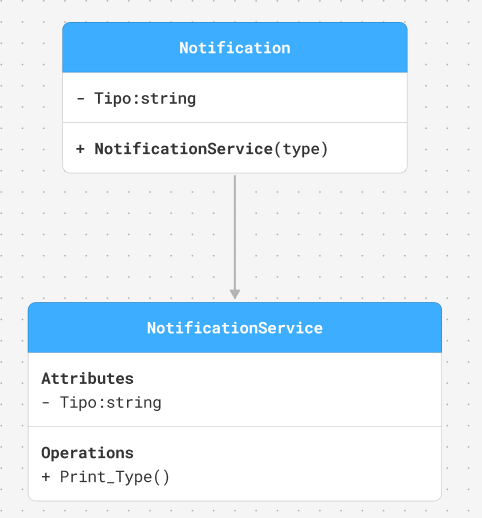
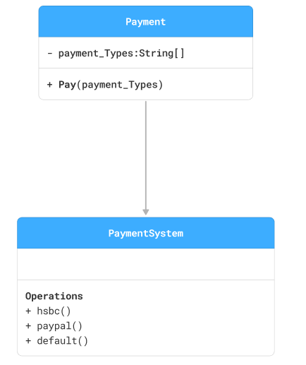
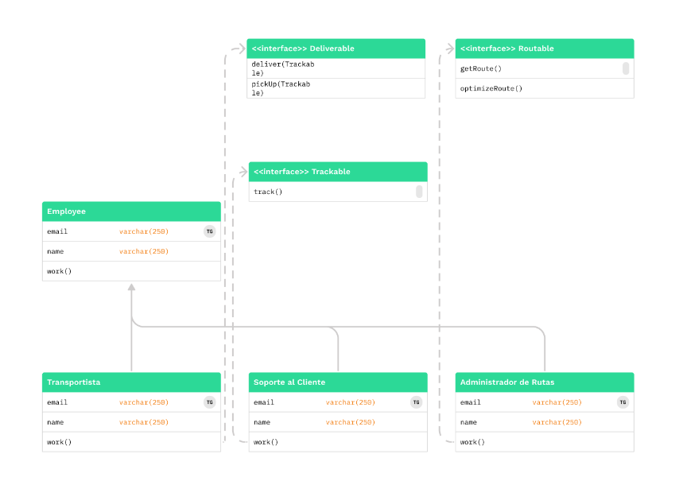
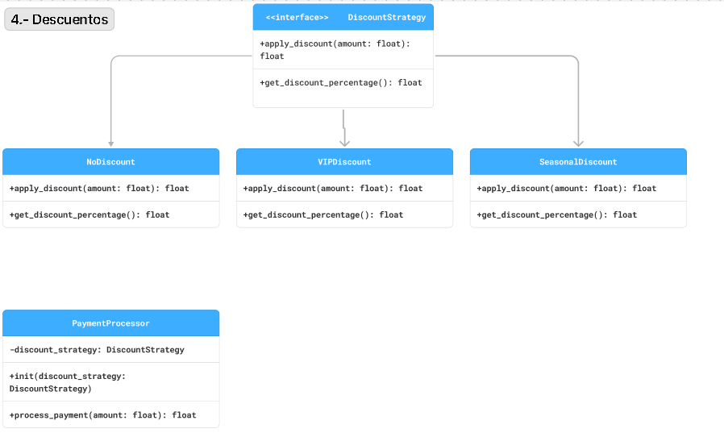
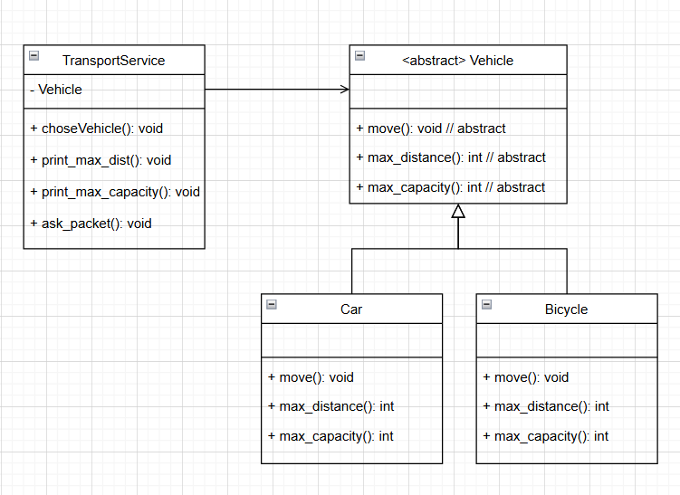

# Principios SOLID

## TC3004B - Planeación de Sistemas de Software

> Luis Marco Barriga Baez A01643954

> David Sanchez Baez A01798202

> Andrès Daniel Martìnez A00227463

> Jacob Garcia Rodriguez A01643891

> Jean Paul López Pándura A01637266

> Victor Javier Quintana Cisneros A01643020

### 1.- Gestión de Notificaciones

### 2.- Sistema de Pagos

### 3.- Gestión de Envíos y Seguimiento de Paquetes

### 4.- Calculadora de Descuentos

### 5.- Sistema de Vehículos

